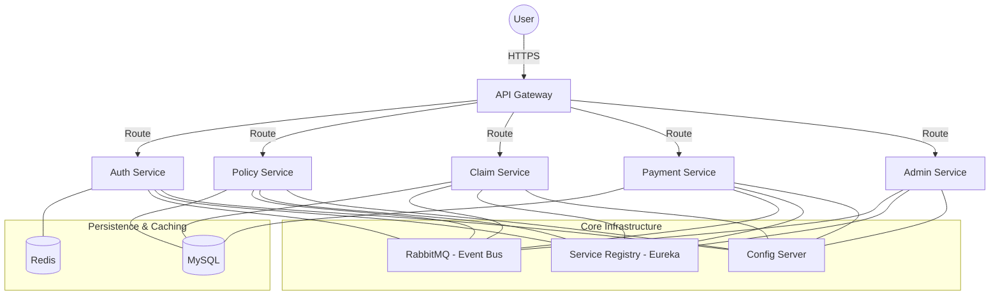

# 🛡️ Smart Sure Insurance

[](https://spring.io/projects/spring-boot)
[](https://angular.io/)
[](#architecture)
[](LICENSE)

**Smart Sure Insurance** is a premium, enterprise-grade insurance management platform. Built with a modern microservices architecture, it provides a seamless experience for policyholders to manage their coverage and for administrators to oversee complex insurance lifecycles with data-driven insights.

---

## 🚀 Key Features

### 👤 For Customers
- **Policy Discovery:** Browse and purchase curated insurance plans tailored to individual needs.
- **Digital Claim Filing:** A streamlined, document-less claim submission process with real-time tracking.
- **Premium Management:** Integrated payment gateway with RazorPay for one-click premium payments and automated schedules.
- **Personalized Dashboard:** Unified view of active policies, payment history, and claim status.

### 💼 For Administrators
- **Customer 360° View:** Comprehensive profiles aggregating policies, payments, and claims in a single interface.
- **Smart Claim Management:** Interactive claim review sidebar with policy validation and payment audit trails.
- **Automated Workflows:** SAGA-based distributed transactions ensuring data consistency across services.
- **Analytics Dashboard:** Real-time monitoring of system health and insurance metrics.

---

## 🏗️ Architecture

The system is designed using a **Microservices Architecture** to ensure high availability, fault tolerance, and independent scalability.



### Microservices Overview:
- **API Gateway:** Centralized entry point, security, and request routing.
- **Service Registry:** Eureka-based dynamic service discovery.
- **Auth Service:** JWT-based secure authentication, user management, and Redis caching.
- **Policy Service:** Core domain service managing policy catalogs and user enrollments.
- **Claim Service:** Handles the end-to-end lifecycle of insurance claims and document validation.
- **Payment Service:** Manages premium transactions and payment gateway integrations.
- **Admin Service:** Specialized administrative logic for customer 360 views and high-level reporting.
- **Notification Service:** Asynchronous event-driven email and SMS notifications via RabbitMQ.
- **Config Server:** Centralized Git-backed configuration management.

---

## 🛠️ Technology Stack

| Layer | Technology |
| :--- | :--- |
| **Frontend** | Angular 19, Tailwind CSS, NgRx (State Management), Lucide Icons |
| **Backend** | Java 17, Spring Boot 3.5, Spring Cloud (2025.x), Spring Security |
| **Messaging** | RabbitMQ (AMQP) for Event-Driven Communication |
| **Caching** | Redis for Session Management & Performance |
| **Database** | MySQL (JPA/Hibernate) |
| **Observability** | Prometheus, Micrometer, Zipkin (Distributed Tracing) |
| **Deployment** | Docker, Docker Compose |

---

## 🚦 Getting Started

### Prerequisites
- **Java 17** or higher
- **Node.js 18+** & npm
- **Docker & Docker Compose**
- **Maven**

### Local Development Setup

1. **Clone the Repository**
   ```bash
   git clone https://github.com/PragyaVijay1222/Smart-Sure-Insurance.git
   cd Smart-Sure-Insurance
   ```

2. **Start Infrastructure (Databases, MQ, Redis)**
   ```bash
   docker-compose up -d
   ```

3. **Run Configuration & Registry Services**
   - Start `config-server-smart-sure`
   - Start `ServiceRegistrySmartSure`

4. **Start Backend Services**
   - Run `AuthService`, `PolicyService`, `claimService`, etc., as Spring Boot applications.

5. **Run Frontend**
   ```bash
   cd "Smart Sure Frontend"
   npm install
   npm start
   ```

---

## 📊 Monitoring

The platform includes built-in support for observability:
- **Actuator Endpoints:** Available on all services for health checks.
- **Prometheus:** Metrics scraping (exposed at port `9090`).
- **Distributed Tracing:** Integrated with Zipkin to monitor request latency across microservices.

---

## 📄 License

This project is licensed under the MIT License - see the [LICENSE](LICENSE) file for details.

---

Developed with ❤️ by the Smart Sure Team.
